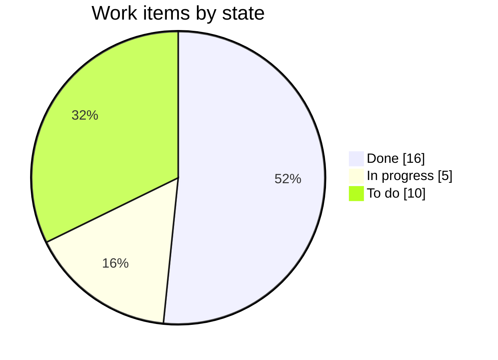
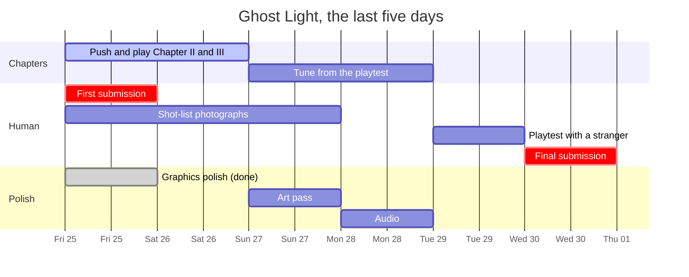

# Status board

**Deadline: Wed 30 September 2026, 23:59 CEST. Last updated Fri 25 Sep: five days left.**

`ROADMAP.md` is the plan and says who owns what. This file is the snapshot:
what is finished, what is in flight, and what is still ahead. When something
moves, move its row. The legend is ✅ done · 🔄 in progress · ⬜ to do ·
⏸️ parked.

---

## At a glance

| Area | State | Where it stands |
|---|---|---|
| Engine, physics, venue | ✅ | Built, measured, and on `main` |
| Chapter I: The Silence | ✅ | Finishable, and exits through the wormhole |
| Chapter II: JavaPolis | 🔄 | Rebuilt as breakdowns; not pushed, not played |
| Chapter III: At Capacity | 🔄 | Trimmed to nine things; not pushed, not played |
| Story between chapters | ✅ | Both wormholes merged (#7, #8) |
| Objective markers | ✅ | Ring, beacon and a robot-shaped icon in that robot's colour; the card names it too. Not pushed |
| Photographer side quest | 🔄 | Code merged (#6); the four photographs are still to come |
| Art | ✅ | Robots walk, lean and look round; shadows, a mood per era, a live menu. Not pushed |
| Audio | ⬜ | Nothing yet |
| Playtest | ⬜ | Nobody has played II or III end to end |
| Submission | ⬜ | First submission was planned for today |

---

## ✅ Done: merged to `main`

| What | PR / branch | Notes |
|---|---|---|
| Stack: three.js, TypeScript strict, Vite 6, Pages deploy | — | Live at <https://lomagnette.github.io/ghost-light/> |
| Physics: 120 Hz fixed step, real mass, payload adds mass | — | `npm run physics` keeps the three robots distinct |
| Venue: the Kinepolis in metres, both floors, raked rooms | — | `npm run venue`, `npm run traverse` |
| Three chapters as data, one gameplay screen | — | |
| The cast modelled from the model sheets | — | Voxxy, Droid, Biggy |
| Verification harnesses | — | `shoot`, `peek`, `physics`, `venue`, `traverse`, `objectives` |
| Library change | #1 `lib-change` | |
| Interior design | #2 `interior-design` | |
| Game intro and NPCs | #3 `introducing-game-and-npc` | |
| Venue graphics | #4 `venue/improve-graphics` | |
| Environment per chapter | #5 `environement-per-chapter-improvement` | |
| Photographer, shot list, Voxxy selfie | #6 `photographer-selfie` | One fixed robot per frame; selfie rendered live |
| Wormhole I → II, Voxxy splits into Droid | #7 `wormhole` | `?exit` to watch it |
| Wormhole II → III, Biggy comes out of Droid | #8 `wormhole-2` | |
| Chapter I finishable: three boards, the dark, the cat and dog | — | |
| MIT `LICENSE` and a README | — | README should be reread before submitting |

---

## 🔄 In progress

| What | Branch | State | Next step | Owner |
|---|---|---|---|---|
| **Chapter II as breakdowns**: eleven timed jobs (bulb, mic cable, adapter, chairs); a missed one empties its room | `chapter-2-breakdowns` | Committed, all harnesses pass, **not pushed** | Push, open a PR, **play it**, tune the `BREAKDOWNS` windows in `src/chapters/objectives.ts` | Agent pushes · human plays |
| **Chapter III lighter**: nine required, conversations optional, 12 stickers | `chapter-3-lighter` (on top of the above) | Committed, all harnesses pass, **not pushed** | Push, open a PR, play: is six minutes still "you cannot do all of it"? | Agent pushes · human plays |
| **Shot-list photographs** | — | Placeholders ("PHOTO TO COME") in the game | Take the four photos and put them in `public/photos/`; see `ROADMAP.md` item 10 | Human |
| **Graphics polish**: robot gait and driving ring, shadows, a mood per era, live menu and readable HUD | `robots-alive` → `shadows` → `mood` → `menu-hud` | Committed, harnesses pass, **not pushed** | Push; check the frame rate on a real GPU with high on, and press G on the menu for low if it struggles | Agent pushes · human checks |
| **Story beat pacing**: about 4 s to leave, 4 s to arrive | merged | Judged from frames only | Watch both wormholes once and say faster or slower | Human |

> **Pushing from the sandbox** needs the GitHub token set once, on the host:
> `sbx secret set github --sandbox devoxx-game -t "$(gh auth token)"`

---

## ⬜ To do

### Before the deadline

| What | Owner | Planned | Notes |
|---|---|---|---|
| **First submission** | Human | Fri 25 Sep (today) | The most recent entry is judged, so an early one is free insurance |
| Judge the feel: drive all three in the lab (`L`) | Human | — | 20 points, and only a person can judge it |
| Check the frame rate on real hardware (`F1`), **on high and on low** | Human | — | Shadows and the mood pass are new GPU cost; the sandbox renders in software, so no number measured here counts |
| Watch the four drone flights against the blockout | Human | — | Not blocking |
| Audio: footfall per robot first, then ambience | Human generates · agent integrates | Mon 28 Sep | Open decision: generated or library. Default: generated |
| Art pass: whatever is left after the polish | Human · agent | Sun 27 Sep | Gait, shadows, mood and menu done 25 Sep |
| Playtest with a stranger, in complete silence | Human | Tue 29 Sep | The 15 playability points |
| README reread and tech/genAI description | Agent | Wed 30 Sep | |
| `docs/PROMPTS.md` kept current | Agent | ongoing | Up to date through the Chapter III trim |
| **Final submission** before 23:59 CEST | Human | Wed 30 Sep | |

### If behind, cut in this order (from `ROADMAP.md`)

1. Chapter II shrinks to a 60-second set piece
2. Chapter II goes entirely
3. Audio drops to footfall only
4. Art stays partial
5. One floor instead of two

**Never cut:** the live build, `LICENSE`, the README, three robots doing distinct things, `docs/PROMPTS.md`.

---

## ⏸️ Parked: after the deadline

| What | Why parked | Notes |
|---|---|---|
| Voiced dialogue | Real people's voices; consent first | Default if it happens is a non-verbal blip per character. See `ROADMAP.md` |

---

## Timeline, remaining days

