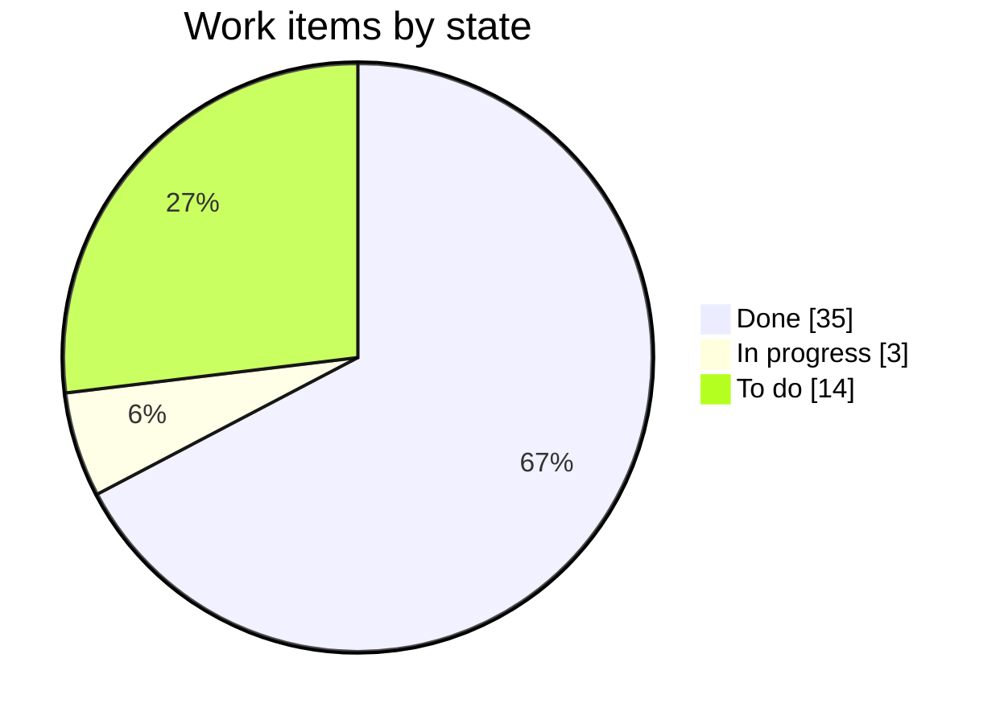
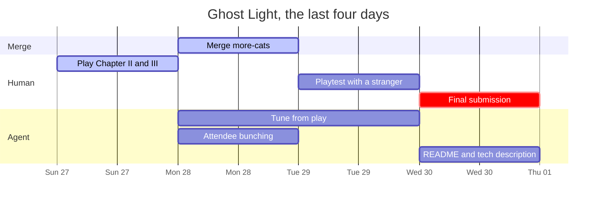

# Status board

**Deadline: Wed 30 September 2026, 23:59 CEST. Last updated Mon 28 Sep: two days left.**

`ROADMAP.md` is the plan and says who owns what. This file is the snapshot:
what is finished, what is in flight, and what is still ahead. When something
moves, move its row. The legend is ✅ done · 🔄 in progress · ⬜ to do ·
⏸️ parked · ❓ not recorded either way.

---

## At a glance

| Area | State | Where it stands |
|---|---|---|
| Engine, physics, venue | ✅ | Built, measured, on `main` |
| Chapter I: The Silence | 🔄 | Finishable; the cat horde is reworked on `more-cats`, **not merged** |
| Chapter II: JavaPolis | 🔄 | Breakdowns merged (#10); **never played by a person**, windows untuned |
| Chapter III: At Capacity | 🔄 | Nine things, merged (#9); **never played by a person** |
| Story between chapters | ✅ | Both wormholes merged (#7, #8), black-zone fix merged (#12) |
| Objective markers | ✅ | Beacons per robot (#15), off-screen arrows and focus on `main` |
| Graphics polish | ✅ | Gait and ring (#16), shadows (#14), mood (#13), menu and HUD (#11) |
| Robot models | ✅ | Rebuilt against the sheets, merged (#17, #18); the author calls them good |
| Attendees | 🔄 | Models merged (#17, #18) and judged good; the bunching is fixed on `crowd-spread`, **not merged** |
| Shot-list photographs | ✅ | **All four** in the game: Room 8, BeJUG, Josh and Biggy, the group with Venkat |
| Venue accuracy | 🔄 | Zones being fixed one at a time as the author names them. Done so far (`stair-cores`, **not merged**): the hall flights are walled cores entered from the side, and the grand stair has its terrace and sits east as on the plan. On `hall-threshold` (from `stair-cores`, **not merged**): the hall is a bay deeper, the reception threshold is a landing with steps on three sides, and there is no ramp (author's call), so Biggy stays on the hall floor |
| Audio | ✅ | Music per chapter, robot and interaction sounds; signed off by the author 28 Sep (`audio` branch, **not merged**) |
| Playtest | ⬜ | Nobody has played II or III end to end |
| Submission | ❓ | First submission was planned for 25 Sep; not recorded here |

```mermaid
pie showData
    title Work items by state
    "Done" : 35
    "In progress" : 3
    "To do" : 14
```

---

## ✅ Done: merged to `main`

| What | PR / branch | Notes |
|---|---|---|
| Stack: three.js, TypeScript strict, Vite 6, Pages deploy | — | Live at <https://lomagnette.github.io/ghost-light/> |
| Physics: 120 Hz fixed step, real mass, payload adds mass | — | `npm run physics` keeps the three robots distinct |
| Venue: the Kinepolis in metres, both floors, raked rooms | — | `npm run venue`, `npm run traverse` |
| Three chapters as data, one gameplay screen | — | |
| Verification harnesses | — | `shoot`, `peek`, `physics`, `venue`, `traverse`, `objectives`, `crowd` |
| Library change | #1 `lib-change` | |
| Interior design | #2 `interior-design` | |
| Game intro and NPCs | #3 `introducing-game-and-npc` | |
| Venue graphics | #4 `venue/improve-graphics` | |
| Environment per chapter | #5 `environement-per-chapter-improvement` | |
| Photographer, shot list, Voxxy selfie | #6 `photographer-selfie` | One fixed robot per frame; selfie rendered live |
| Wormhole I → II, Voxxy splits into Droid | #7 `wormhole` | `?exit` to watch it |
| Wormhole II → III, Biggy comes out of Droid | #8 `wormhole-2` | |
| Chapter III lighter: nine required, side quests counted as "extra" | #9 `chapter-3-lighter` | |
| Chapter II as breakdowns: reach, fit, speed, strength | #10 `chapter-2-breakdowns` | Lectern moved for a 0.80 m slot |
| Menu backdrop and readable HUD | #11 `menu-hud` | G on the menu switches graphics |
| Wormhole black zone on real GPUs | #12 `fix-wormhole-black` | NaN scrub before the bloom |
| A mood per era | #13 `mood` | High quality only |
| Soft shadows from a second light | #14 `shadows` | High quality only |
| Objective beacons: ring, beam, robot-shaped icon | #15 `objective-markers` | |
| Robots walk, lean, look round; ring on the driven one | #16 `robots-alive` | |
| Off-screen arrows and focus on the driven robot | `markers-2` | Went to `main` without a PR number |
| Chapter I finishable: three boards, the dark, the cat and dog | — | |
| MIT `LICENSE` and a README | — | README should be reread before submitting |
| **The robots' feel, judged by a person** | — | 27 Sep: the author drove them and calls the feel OK. Closed; the movement numbers stay guarded by `npm run physics` |
| **Both wormholes watched** | — | 27 Sep: the author says they look great. Pacing unchanged: about 4 s to leave, 4 s to arrive |
| Robots rebuilt against the model sheets | #17, #18 `robot-models`, `attendees` | 28 Sep: the author calls them good |
| Attendees with legs, hands, hair, lanyards and a walk | #17, #18 `attendees` | 28 Sep: judged good; the bunching is its own row under To do |
| All four shot-list photographs in the game | `more-cats` | 28 Sep: `josh-long.jpeg` and `group.jpeg` added and wired; every print shows at the same 3:2 frame |
| Faster stairs, portraits beside dialogue | #20 `dialogue-portraits` | Stairs at 60% of top speed; portraits go in `src/portraits/` |
| No stutter when a Chapter I light comes on | #19 `fix-light-stutter` | Light rigs prebuilt, no shader recompile |
| **Audio: music and sound** | `audio` | 28 Sep: three Suno tracks, one per chapter, at half level in II and III; robots' steps, impacts and motors and the interaction cues synthesised; Voxxy softened after the first listen. Closed on the author's word. Left for later if ever: brakes, stairs, breakdown cues, cats. Still to check: Suno's terms for an MIT repo |
| Title sequence and lore, before the menu | `intro` | 28 Sep: seven lines over the dark hall with Chapter I's music, about 50 s, the author's 2126 frame; starts on its own, the first key turns the sound on, then any key (or ESC at any time) skips; plays once, I replays. Hints, never explains: SPEC's rule that the game does not say why the building is empty still holds. **Not merged** |
| Room 6 has a way in | `room-6-door` | 28 Sep: its door opened onto the open well beside the grand stair; moved to the north end. `npm run traverse` now walks into all fourteen rooms |
| **Performance checked on real hardware** | — | 27 Sep: the author reports the frame rate fine. The one stutter, a Chapter I light coming on, is fixed on `fix-light-stutter` (no shader recompile). Closed; reopen if anything shows up |

---

## 🔄 In progress

| What | Branch | State | Next step | Owner |
|---|---|---|---|---|
| **Chapter I cats**: random spawns on a timer, horde, pathing, the dog sends them away, eight coats; plus the last two photos | `more-cats` | Committed, **not pushed** | Push `more-cats`, open a PR, merge; then play Chapter I for difficulty | Human |
| **Chapter II and III balance** | merged | Windows set from distances and speeds, not from play | Play both, then retune `BREAKDOWNS` and Chapter III's clock from what you felt | Human plays · agent tunes |

> **Pushing from the sandbox** still fails on credentials. Either push from
> the host, or set the token once:
> `sbx secret set github --sandbox devoxx-game -t "$(gh auth token)"`

---

## ⬜ To do

### Before the deadline

| What | Owner | Planned | Notes |
|---|---|---|---|
| **First submission** ❓ | Human | was Fri 25 Sep | Tick this if it went in. If not, submit today: the most recent entry is judged, so an early one is free insurance |
| Play Chapter II and III end to end | Human | Sun 27 Sep | Is II fair with two robots and one pair of hands? Is III still "you cannot do all of it" at nine? |
| **Remodel the venue zones that are not yet true to the real Kinepolis** | Human names them · agent rebuilds | Mon 28 Sep | 28 Sep, fixed on `stair-cores`: the two hall flights are walled cores with a door in each side of the vestibule at the foot (`hollywood-area.png`); the grand stair now starts from a terrace at the end of the corridor, off to the east, with the curved wall beside it (`access-main-stairs.png`). On `hall-threshold`: the hall is 6.3 m deeper at the north, and the threshold is mapped off `stairs-exhibition-reception.png`: a landing, steps on three sides, and a box at the west end. The wheelchair ramp is gone at the author's request. BOF 3's door onto the drop is gone. On `reception-east`: the old BOF 1–3 are replaced by two BOF rooms from `bof-rooms.png`, down three steps off the reception, with the BeJUG photograph back in BOF 1. The toilets are rebuilt in the north-east corner from `toilet-reception.png`. On `reception-centre`: the information island, five pillars, the free counter and the stair hall's east side are mapped off `reception-desk.png` on the column grid. The grand flight now runs wall to wall (14.8 m), and upstairs the corridor is 5.4 m wider along its whole east side to take it, Rooms 7 to 14 moved east with it. On `hall-north-east`: the hall's east side steps as `exhibition-floor.jpg` draws it, with outside beyond (no more closed blocks), and the polo pickup is an L-shaped counter in the hall. On `entrance-doors`: every bay of the glazed ground floor is a glass door you can drive through, and the floodlight boxes in the doorway are gone. On `stair-swap`: a robot changes storey half way up a flight, not at the top step, so the view swaps at mid-height. More zones still to be named: point at each with a photo, a plan or a drone-flight timestamp. Each fix is `src/venue/kinepolis.ts`, then `npm run venue`, `traverse` and `objectives`, because every activity is coordinates and moving a wall can put one inside it |
| 🔄 **Attendees bunch up in some areas of the map** | Agent | Mon 28 Sep | **Fixed 28 Sep on `crowd-spread`, not merged.** A bug in how walkers pick their next step pushed everyone north-east, so every room emptied into its top-right corner (37× the average in the reception). Also fixed: people following walls, and a pocket in the reception desk nobody could leave. `npm run crowd` now guards it: worst cell 3.6× average. Needs a look in the game |
| Playtest with a stranger, in complete silence | Human | Tue 29 Sep | The 15 playability points |
| Tune from the playtest | Agent | Tue 29 Sep | Windows, clocks, anything a stranger got stuck on |
| README reread and tech/genAI description | Agent | Wed 30 Sep | |
| `docs/PROMPTS.md` kept current | Agent | ongoing | Up to date through the attendees |
| **Final submission** before 23:59 CEST | Human | Wed 30 Sep | |

### Design follow-ups, added 27 Sep

| What | Owner | Notes |
|---|---|---|
| **Better story content for Chapter II** | Human · agent | The corridor conversations and the breakdowns carry the chapter now, but not a story of their own. What is JavaPolis 2006 about, for the two robots who just fell into it? Worth deciding before the dialogue pass below, which would rewrite the same lines |
| **Show the object a robot-specific job is about** | Agent | When a job needs one robot, the THING should say why: a projector visibly two metres up in the booth, the cable behind the lectern, the adapter on the organisers' desk, the stack of chairs in the foyer, the keg, the shutter. The marker says whose job it is; the object should say why it is theirs. Props are `decor` in `kinepolis.ts` or drawn per activity |
| 🔄 **Chapter I: more cats, more over time** | Agent | **Built 28 Sep on `more-cats`.** Five cats at the start and one every 20 s at random spots, up to 16, each in one of eight coats. Coming close to the first one starts its talk; after that no cat talks. They then follow Voxxy as a horde, round walls and up the stairs, and each one underfoot slows Voxxy (to 40% at worst). The dog has 90 s; reaching it starts its talk and the cats run off. Missing it fails the chapter. Needs a person to play it for difficulty |
| **Tune the dialogue against real transcripts** | Human supplies transcripts · agent rewrites | Make each speaker sound like themselves: cadence, phrasing, what they tend to talk about. The rules stay: nothing put in anyone's mouth that is not plainly true of their public work, and Chapter II stays era-locked around 2006. The sandbox cannot browse, so transcripts or links come from the host; each source is logged in `docs/PROMPTS.md` |

### Small, whenever there is a gap

| What | Owner | Notes |
|---|---|---|
| Off-screen arrow labels overlap when two arrows land close together | Agent | Push them apart along the edge |
| Watch the four drone flights against the blockout | Human | Not blocking |

### Open decisions

| Decision | Default if unanswered |
|---|---|
| Arrows in Chapter I: always, off, or only after 30 s without progress? | Always (current). Chapter I is about finding your way in the dark, and they point at every board — and now at every ticking cat |
| Skin in the crowd: the stylised warm band, or a real range for the anonymous crowd only? | Stylised band (current). A real range on the named people is out either way |

### If behind, cut in this order (from `ROADMAP.md`)

1. Chapter II shrinks to a 60-second set piece
2. Chapter II goes entirely
3. Audio drops to footfall only
4. Art stays partial
5. One floor instead of two

**Never cut:** the live build, `LICENSE`, the README, three robots doing distinct things, `docs/PROMPTS.md`.

---

## ⏸️ Parked: after the deadline

| What | Why parked | Notes |
|---|---|---|
| Voiced dialogue | Real people's voices; consent first | Default if it happens is a non-verbal blip per character. See `ROADMAP.md` |

---

## Timeline, remaining days

```mermaid
gantt
    title Ghost Light, the last four days
    dateFormat YYYY-MM-DD
    axisFormat %a %d
    section Merge
    Merge more-cats                   :active, m1, 2026-09-28, 1d
    section Human
    Play Chapter II and III           :active, h1, 2026-09-27, 1d
    Playtest with a stranger          :t1, 2026-09-29, 1d
    Final submission                  :crit, s2, 2026-09-30, 1d
    section Agent
    Tune from play                    :g1, after h1, 2d
    Attendee bunching                 :g4, 2026-09-28, 1d
    README and tech description       :g3, 2026-09-30, 1d
```
