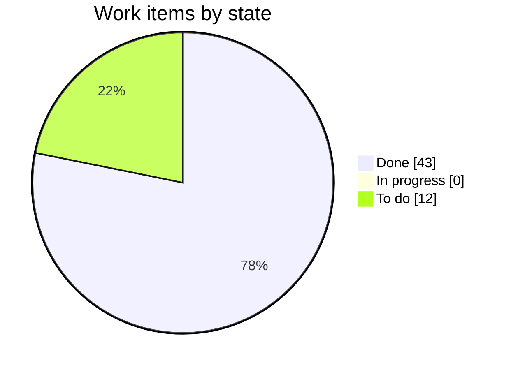
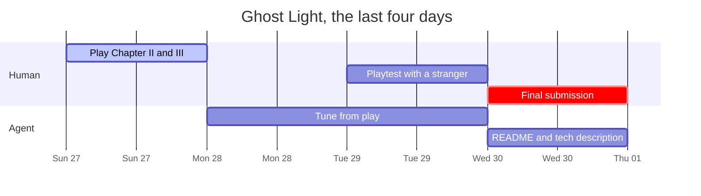

# Status board

**Deadline: Wed 30 September 2026, 23:59 CEST. Last updated Mon 28 Sep, late evening: two days left.**

`ROADMAP.md` is the plan and says who owns what. This file is the snapshot:
what is finished, what is in flight, and what is still ahead. When something
moves, move its row. The legend is ✅ done · 🔄 in progress · ⬜ to do ·
⏸️ parked · ❓ not recorded either way.

---

## At a glance

| Area | State | Where it stands |
|---|---|---|
| Engine, physics, venue | ✅ | Built, measured, on `main` |
| Chapter I: The Silence | ✅ | Finishable, and the cat horde is done and on `main` |
| Chapter II: JavaPolis | ✅ | Nine breakdowns in Rooms 3–8 with gaps for the speakers, merged (#32); balance done for now, on the author's word (28 Sep) |
| Chapter III: At Capacity | ✅ | Nine things in Rooms 3–10, merged (#9, #32); balance done for now, on the author's word (28 Sep) |
| Story between chapters | ✅ | Both wormholes merged (#7, #8), black-zone fix merged (#12) |
| Objective markers | ✅ | Beacons per robot (#15), off-screen arrows and focus on `main` |
| Graphics polish | ✅ | Gait and ring (#16), shadows (#14), mood (#13), menu and HUD (#11) |
| Robot models | ✅ | Rebuilt against the sheets, merged (#17, #18); the author calls them good |
| Attendees | ✅ | Models merged (#17, #18) and judged good; the bunching fix is merged (#21) |
| Shot-list photographs | ✅ | **All four** in the game: Room 8, BeJUG, Josh and Biggy, the group with Venkat |
| Venue accuracy | ✅ | **Good enough for now** (the author, 28 Sep). Zones remodelled from the author's plans and merged (#25–#31), the front's glass doors, the storey swap and the longer grand flight included; the job objects, stanchions and corridor tables merged (#32–#34). One cinema-room improvement is noted for later |
| Audio | ✅ | Music per chapter, robot and interaction sounds; signed off by the author 28 Sep and merged (#22) |
| Playtest | ⬜ | Nobody has played II or III end to end |
| Submission | ❓ | First submission was planned for 25 Sep; not recorded here |

```mermaid
pie showData
    title Work items by state
    "Done" : 43
    "In progress" : 0
    "To do" : 12
```

---

## ✅ Done: merged to `main`

| What | PR / branch | Notes |
|---|---|---|
| Stack: three.js, TypeScript strict, Vite 6, Pages deploy | — | Live at <https://lomagnette.github.io/ghost-light/> |
| Physics: 120 Hz fixed step, real mass, payload adds mass | — | `npm run physics` keeps the three robots distinct |
| Venue: the Kinepolis in metres, both floors, raked rooms | — | `npm run venue`, `npm run traverse` |
| Three chapters as data, one gameplay screen | — | |
| Verification harnesses | — | `shoot`, `peek`, `physics`, `venue`, `traverse`, `objectives`, `crowd` |
| Library change | #1 `lib-change` | |
| Interior design | #2 `interior-design` | |
| Game intro and NPCs | #3 `introducing-game-and-npc` | |
| Venue graphics | #4 `venue/improve-graphics` | |
| Environment per chapter | #5 `environement-per-chapter-improvement` | |
| Photographer, shot list, Voxxy selfie | #6 `photographer-selfie` | One fixed robot per frame; selfie rendered live |
| Wormhole I → II, Voxxy splits into Droid | #7 `wormhole` | `?exit` to watch it |
| Wormhole II → III, Biggy comes out of Droid | #8 `wormhole-2` | |
| Chapter III lighter: nine required, side quests counted as "extra" | #9 `chapter-3-lighter` | |
| Chapter II as breakdowns: reach, fit, speed, strength | #10 `chapter-2-breakdowns` | Lectern moved for a 0.80 m slot |
| Menu backdrop and readable HUD | #11 `menu-hud` | G on the menu switches graphics |
| Wormhole black zone on real GPUs | #12 `fix-wormhole-black` | NaN scrub before the bloom |
| A mood per era | #13 `mood` | High quality only |
| Soft shadows from a second light | #14 `shadows` | High quality only |
| Objective beacons: ring, beam, robot-shaped icon | #15 `objective-markers` | |
| Robots walk, lean, look round; ring on the driven one | #16 `robots-alive` | |
| Off-screen arrows and focus on the driven robot | `markers-2` | Went to `main` without a PR number |
| Chapter I finishable: three boards, the dark, the cat and dog | — | |
| MIT `LICENSE` and a README | — | README should be reread before submitting |
| **The robots' feel, judged by a person** | — | 27 Sep: the author drove them and calls the feel OK. Closed; the movement numbers stay guarded by `npm run physics` |
| **Both wormholes watched** | — | 27 Sep: the author says they look great. Pacing unchanged: about 4 s to leave, 4 s to arrive |
| Robots rebuilt against the model sheets | #17, #18 `robot-models`, `attendees` | 28 Sep: the author calls them good |
| Attendees with legs, hands, hair, lanyards and a walk | #17, #18 `attendees` | 28 Sep: judged good; the bunching is its own row under To do |
| All four shot-list photographs in the game | `more-cats`, on `main` | 28 Sep: `josh-long.jpeg` and `group.jpeg` added and wired; every print shows at the same 3:2 frame |
| Faster stairs, portraits beside dialogue | #20 `dialogue-portraits` | Stairs at 60% of top speed; portraits go in `src/portraits/` |
| No stutter when a Chapter I light comes on | #19 `fix-light-stutter` | Light rigs prebuilt, no shader recompile |
| **Audio: music and sound** | #22 `audio` | 28 Sep: three Suno tracks, one per chapter, at half level in II and III; robots' steps, impacts and motors and the interaction cues synthesised; Voxxy softened after the first listen. Closed on the author's word. Left for later if ever: brakes, stairs, breakdown cues, cats. Still to check: Suno's terms for an MIT repo |
| Title sequence and lore, before the menu | #24 `intro` | 28 Sep: seven lines over the dark hall with Chapter I's music, about 50 s, the author's 2126 frame; starts on its own, the first key turns the sound on, then any key (or ESC at any time) skips; plays once, I replays. Hints, never explains: SPEC's rule that the game does not say why the building is empty still holds. Merged (#24) |
| Room 6 has a way in | #23 `room-6-door` | 28 Sep: its door opened onto the open well beside the grand stair; moved to the north end. `npm run traverse` now walks into all fourteen rooms |
| **Chapter I cats**: five at the start and one every 20 s up to 16, eight coats, a horde that follows Voxxy round walls and up the stairs and slows it, the dog sends them away | `more-cats`, on `main` | 28 Sep: done, on the author's word |
| Attendees no longer bunch into every room's north-east corner | #21 `crowd-spread` | `npm run crowd` guards it: worst cell 3.6× the average |
| **The venue remodelled zone by zone, from the author's plans** | #25 `reception-east`, #26 `stair-cores`, #27 `hall-threshold`, #28 `reception-centre`, #29 `hall-north-east` | 28 Sep, the author: "good enough for now". What changed:<ul><li>the hall flights are walled cores entered from the side;</li><li>the hall is a bay deeper, and the threshold has a landing with steps on three sides and no ramp;</li><li>two BOF rooms down three steps, and toilets in the north-east corner;</li><li>the reception island, five pillars and the free counter are on the column grid;</li><li>the grand flight runs wall to wall, with the corridor upstairs 5.4 m wider along its whole east side;</li><li>the hall's east side steps as drawn, and the polo pickup is an L-shaped counter</li></ul> |
| Glass doors across the whole front; the storey swaps half way up a flight; one tread per riser; a 10.2 m grand flight of 34 steps | #30 `entrance-doors`, #31 `stair-treads` (with `stair-swap`) | 28 Sep |
| **The objects the jobs are about, and Chapter II retuned** | #32 `job-props` | 28 Sep: every job shows its object (board, rack, projector, cable, adapter, chairs, coffee, keg, shutter, mic, scanner, polo) with a lamp for broken or fixed; the zones and pickup range are wider, and the projector counts anywhere in the back aisle. Devoxx uses Rooms 3–10, JavaPolis 3–8. Chapter II has nine breakdowns, not eleven, with longer windows and gaps for the speakers |
| **Stanchions where the rooms in use stop** | #33 `session-drape` | 28 Sep: posts and a red rope across the upstairs corridor, open in the middle. The author: "perfect" |
| **Long tables along the corridor**, between Rooms 5/6 and 7/8 | #34 `corridor-tables` | 28 Sep: chairs on both sides, a metre off the wall, starting 2 m past each door so the entrances stay free; the chair flicker (coplanar faces) is fixed. The west tables show only through the cutaway |
| **Chapter II and III balance** | #32 `job-props` | 28 Sep: done for now, on the author's word. Chapter II has nine breakdowns with longer windows; Rooms 3–8 for JavaPolis, 3–10 for Devoxx. Reopen after the stranger playtest if it shows a wall |
| **Performance checked on real hardware** | — | 27 Sep: the author reports the frame rate fine. The one stutter, a Chapter I light coming on, is fixed on `fix-light-stutter` (no shader recompile). Closed; reopen if anything shows up |

---

## 🔄 In progress

| What | Branch | State | Next step | Owner |
|---|---|---|---|---|
| _Nothing in flight._ | | | | |

> **Pushing from the sandbox** still fails on credentials. Either push from
> the host, or set the token once:
> `sbx secret set github --sandbox devoxx-game -t "$(gh auth token)"`

---

## ⬜ To do

### Before the deadline

| What | Owner | Planned | Notes |
|---|---|---|---|
| **First submission** ❓ | Human | was Fri 25 Sep | Tick this if it went in. If not, submit today: the most recent entry is judged, so an early one is free insurance |
| Play Chapter II and III end to end | Human | Sun 27 Sep | Is II fair with two robots and one pair of hands? Is III still "you cannot do all of it" at nine? |
| Playtest with a stranger, in complete silence | Human | Tue 29 Sep | The 15 playability points |
| Tune from the playtest | Agent | Tue 29 Sep | Windows, clocks, anything a stranger got stuck on |
| README reread and tech/genAI description | Agent | Wed 30 Sep | |
| `docs/PROMPTS.md` kept current | Agent | ongoing | Up to date through the status update of 28 Sep evening |
| **Final submission** before 23:59 CEST | Human | Wed 30 Sep | |

### Design follow-ups, added 27 Sep

| What | Owner | Notes |
|---|---|---|
| **Better story content for Chapter II** | Human · agent | The corridor conversations and the breakdowns carry the chapter now, but not a story of their own. What is JavaPolis 2006 about, for the two robots who just fell into it? Worth deciding before the dialogue pass below, which would rewrite the same lines |
| **Tune the dialogue against real transcripts** | Human supplies transcripts · agent rewrites | Make each speaker sound like themselves: cadence, phrasing, what they tend to talk about. The rules stay: nothing put in anyone's mouth that is not plainly true of their public work, and Chapter II stays era-locked around 2006. The sandbox cannot browse, so transcripts or links come from the host; each source is logged in `docs/PROMPTS.md` |

### Small, whenever there is a gap

| What | Owner | Notes |
|---|---|---|
| Off-screen arrow labels overlap when two arrows land close together | Agent | Push them apart along the edge |
| Watch the four drone flights against the blockout | Human | Not blocking |
| **One improvement to the cinema rooms**, for later | Human names it · agent builds | 28 Sep: the author has one in mind and hasn't said what it is yet. The rest of the venue is good enough for now |

### Open decisions

| Decision | Default if unanswered |
|---|---|
| Arrows in Chapter I: always, off, or only after 30 s without progress? | Always (current). Chapter I is about finding your way in the dark, and they point at every board — and now at every ticking cat |
| Skin in the crowd: the stylised warm band, or a real range for the anonymous crowd only? | Stylised band (current). A real range on the named people is out either way |

### If behind, cut in this order (from `ROADMAP.md`)

1. Chapter II shrinks to a 60-second set piece
2. Chapter II goes entirely
3. Audio drops to footfall only
4. Art stays partial
5. One floor instead of two

**Never cut:** the live build, `LICENSE`, the README, three robots doing distinct things, `docs/PROMPTS.md`.

---

## ⏸️ Parked: after the deadline

| What | Why parked | Notes |
|---|---|---|
| Voiced dialogue | Real people's voices; consent first | Default if it happens is a non-verbal blip per character. See `ROADMAP.md` |

---

## Timeline, remaining days

```mermaid
gantt
    title Ghost Light, the last four days
    dateFormat YYYY-MM-DD
    axisFormat %a %d
    section Human
    Play Chapter II and III           :active, h1, 2026-09-27, 1d
    Playtest with a stranger          :t1, 2026-09-29, 1d
    Final submission                  :crit, s2, 2026-09-30, 1d
    section Agent
    Tune from play                    :g1, after h1, 2d
    README and tech description       :g3, 2026-09-30, 1d
```
