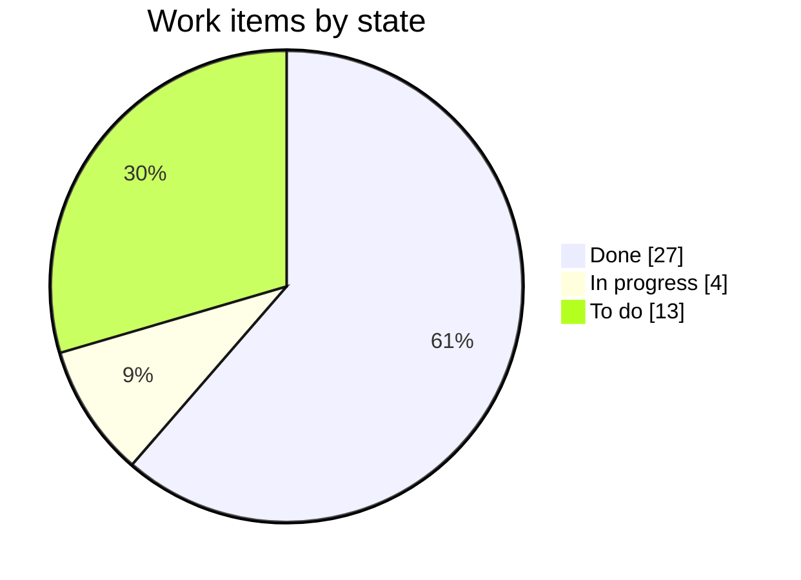
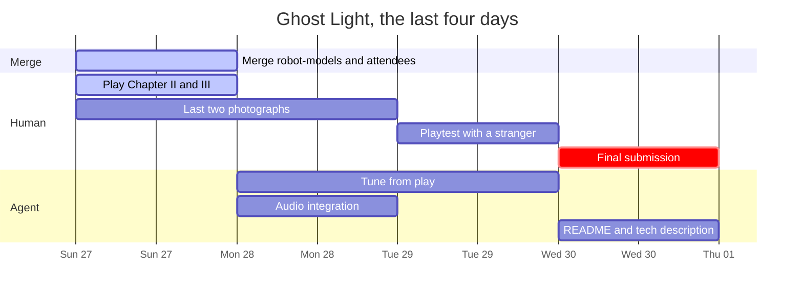

# Status board

**Deadline: Wed 30 September 2026, 23:59 CEST. Last updated Sun 27 Sep: three days left.**

`ROADMAP.md` is the plan and says who owns what. This file is the snapshot:
what is finished, what is in flight, and what is still ahead. When something
moves, move its row. The legend is ✅ done · 🔄 in progress · ⬜ to do ·
⏸️ parked · ❓ not recorded either way.

---

## At a glance

| Area | State | Where it stands |
|---|---|---|
| Engine, physics, venue | ✅ | Built, measured, on `main` |
| Chapter I: The Silence | ✅ | Finishable; exits through the wormhole |
| Chapter II: JavaPolis | 🔄 | Breakdowns merged (#10); **never played by a person**, windows untuned |
| Chapter III: At Capacity | 🔄 | Nine things, merged (#9); **never played by a person** |
| Story between chapters | ✅ | Both wormholes merged (#7, #8), black-zone fix merged (#12) |
| Objective markers | ✅ | Beacons per robot (#15), off-screen arrows and focus on `main` |
| Graphics polish | ✅ | Gait and ring (#16), shadows (#14), mood (#13), menu and HUD (#11) |
| Robot models | 🔄 | Rebuilt against the sheets; `robot-models` pushed, **not merged** |
| Attendees | 🔄 | Legs, hands, hair, lanyards; `attendees` partly pushed, **not merged** |
| Shot-list photographs | 🔄 | **2 of 4** in the game: Room 8, BeJUG |
| Venue accuracy | ⬜ | Some zones still differ from the real building; list to come |
| Audio | ⬜ | Planned in `docs/AUDIO.md`; nothing playing yet |
| Playtest | ⬜ | Nobody has played II or III end to end |
| Submission | ❓ | First submission was planned for 25 Sep; not recorded here |

```mermaid
pie showData
    title Work items by state
    "Done" : 27
    "In progress" : 4
    "To do" : 13
```

---

## ✅ Done: merged to `main`

| What | PR / branch | Notes |
|---|---|---|
| Stack: three.js, TypeScript strict, Vite 6, Pages deploy | — | Live at <https://lomagnette.github.io/ghost-light/> |
| Physics: 120 Hz fixed step, real mass, payload adds mass | — | `npm run physics` keeps the three robots distinct |
| Venue: the Kinepolis in metres, both floors, raked rooms | — | `npm run venue`, `npm run traverse` |
| Three chapters as data, one gameplay screen | — | |
| Verification harnesses | — | `shoot`, `peek`, `physics`, `venue`, `traverse`, `objectives` |
| Library change | #1 `lib-change` | |
| Interior design | #2 `interior-design` | |
| Game intro and NPCs | #3 `introducing-game-and-npc` | |
| Venue graphics | #4 `venue/improve-graphics` | |
| Environment per chapter | #5 `environement-per-chapter-improvement` | |
| Photographer, shot list, Voxxy selfie | #6 `photographer-selfie` | One fixed robot per frame; selfie rendered live |
| Wormhole I → II, Voxxy splits into Droid | #7 `wormhole` | `?exit` to watch it |
| Wormhole II → III, Biggy comes out of Droid | #8 `wormhole-2` | |
| Chapter III lighter: nine required, side quests counted as "extra" | #9 `chapter-3-lighter` | |
| Chapter II as breakdowns: reach, fit, speed, strength | #10 `chapter-2-breakdowns` | Lectern moved for a 0.80 m slot |
| Menu backdrop and readable HUD | #11 `menu-hud` | G on the menu switches graphics |
| Wormhole black zone on real GPUs | #12 `fix-wormhole-black` | NaN scrub before the bloom |
| A mood per era | #13 `mood` | High quality only |
| Soft shadows from a second light | #14 `shadows` | High quality only |
| Objective beacons: ring, beam, robot-shaped icon | #15 `objective-markers` | |
| Robots walk, lean, look round; ring on the driven one | #16 `robots-alive` | |
| Off-screen arrows and focus on the driven robot | `markers-2` | Went to `main` without a PR number |
| Chapter I finishable: three boards, the dark, the cat and dog | — | |
| MIT `LICENSE` and a README | — | README should be reread before submitting |
| **The robots' feel, judged by a person** | — | 27 Sep: the author drove them and calls the feel OK. Closed; the movement numbers stay guarded by `npm run physics` |
| **Both wormholes watched** | — | 27 Sep: the author says they look great. Pacing unchanged: about 4 s to leave, 4 s to arrive |
| **Performance checked on real hardware** | — | 27 Sep: the author reports the frame rate fine. The one stutter, a Chapter I light coming on, is fixed on `fix-light-stutter` (no shader recompile). Closed; reopen if anything shows up |

---

## 🔄 In progress

| What | Branch | State | Next step | Owner |
|---|---|---|---|---|
| **Robots rebuilt against the model sheets**: Voxxy's visor, ears and banded arms; Droid dark and jointed; Biggy's helmet and backpack | `robot-models` | Pushed, harnesses pass, **not merged** | Open a PR and merge | Human |
| **Attendees**: two legs and shoes, hands, hair, lanyard and badge, backpacks, a walk from distance | `attendees` (on top of `robot-models`) | Pushed up to the remodel; **3 newer commits not pushed** (the `.jpeg` names, a tool fix, the two photos wired) | Push `attendees` again, open a PR, merge | Human |
| **Shot-list photographs** | `attendees` | `room-8.jpeg` and `bejug-banner.jpeg` wired in. `room-8.jpeg` is 681 KB; a 1020 × 680 copy would be about a seventh of that | Add `josh-long.jpeg` (Biggy, Josh sitting on it) and `group.jpeg` (all three, Venkat) to `public/photos/`; the agent wires them | Human, then agent |
| **Chapter II and III balance** | merged | Windows set from distances and speeds, not from play | Play both, then retune `BREAKDOWNS` and Chapter III's clock from what you felt | Human plays · agent tunes |

> **Pushing from the sandbox** still fails on credentials. Either push from
> the host, or set the token once:
> `sbx secret set github --sandbox devoxx-game -t "$(gh auth token)"`

---

## ⬜ To do

### Before the deadline

| What | Owner | Planned | Notes |
|---|---|---|---|
| **First submission** ❓ | Human | was Fri 25 Sep | Tick this if it went in. If not, submit today: the most recent entry is judged, so an early one is free insurance |
| Play Chapter II and III end to end | Human | Sun 27 Sep | Is II fair with two robots and one pair of hands? Is III still "you cannot do all of it" at nine? |
| **Remodel the venue zones that are not yet true to the real Kinepolis** | Human names them · agent rebuilds | Mon 28 Sep | Which zones is still to be listed: point at each with a photo, a plan or a drone-flight timestamp. Each fix is `src/venue/kinepolis.ts`, then `npm run venue`, `traverse` and `objectives`, because every activity is coordinates and moving a wall can put one inside it |
| Audio: sound and music | Agent synthesises the robots and UI · human supplies ambience and music | Mon 28 Sep | Planned 27 Sep in `docs/AUDIO.md`, with the list of files and their names |
| Playtest with a stranger, in complete silence | Human | Tue 29 Sep | The 15 playability points |
| Tune from the playtest | Agent | Tue 29 Sep | Windows, clocks, anything a stranger got stuck on |
| README reread and tech/genAI description | Agent | Wed 30 Sep | |
| `docs/PROMPTS.md` kept current | Agent | ongoing | Up to date through the attendees |
| **Final submission** before 23:59 CEST | Human | Wed 30 Sep | |

### Design follow-ups, added 27 Sep

| What | Owner | Notes |
|---|---|---|
| **Better story content for Chapter II** | Human · agent | The corridor conversations and the breakdowns carry the chapter now, but not a story of their own. What is JavaPolis 2006 about, for the two robots who just fell into it? Worth deciding before the dialogue pass below, which would rewrite the same lines |
| **Show the object a robot-specific job is about** | Agent | When a job needs one robot, the THING should say why: a projector visibly two metres up in the booth, the cable behind the lectern, the adapter on the organisers' desk, the stack of chairs in the foyer, the keg, the shutter. The marker says whose job it is; the object should say why it is theirs. Props are `decor` in `kinepolis.ts` or drawn per activity |
| 🔄 **Chapter I: more cats, more over time** | Agent | **Built 28 Sep on `more-cats`, reworked the same day.** A cat every 20 s from the start at random spots, up to 16. The first reached talks and lights the 45 s; then they all follow Voxxy and each one underfoot slows it (to 40% at worst). The dog calls them off for good; missing it fails the chapter. Needs a person to play it for difficulty |
| **Tune the dialogue against real transcripts** | Human supplies transcripts · agent rewrites | Make each speaker sound like themselves: cadence, phrasing, what they tend to talk about. The rules stay: nothing put in anyone's mouth that is not plainly true of their public work, and Chapter II stays era-locked around 2006. The sandbox cannot browse, so transcripts or links come from the host; each source is logged in `docs/PROMPTS.md` |

### Small, whenever there is a gap

| What | Owner | Notes |
|---|---|---|
| Off-screen arrow labels overlap when two arrows land close together | Agent | Push them apart along the edge |
| Watch the four drone flights against the blockout | Human | Not blocking |

### Open decisions

| Decision | Default if unanswered |
|---|---|
| Arrows in Chapter I: always, off, or only after 30 s without progress? | Always (current). Chapter I is about finding your way in the dark, and they point at every board — and now at every ticking cat |
| Skin in the crowd: the stylised warm band, or a real range for the anonymous crowd only? | Stylised band (current). A real range on the named people is out either way |

### If behind, cut in this order (from `ROADMAP.md`)

1. Chapter II shrinks to a 60-second set piece
2. Chapter II goes entirely
3. Audio drops to footfall only
4. Art stays partial
5. One floor instead of two

**Never cut:** the live build, `LICENSE`, the README, three robots doing distinct things, `docs/PROMPTS.md`.

---

## ⏸️ Parked: after the deadline

| What | Why parked | Notes |
|---|---|---|
| Voiced dialogue | Real people's voices; consent first | Default if it happens is a non-verbal blip per character. See `ROADMAP.md` |

---

## Timeline, remaining days

```mermaid
gantt
    title Ghost Light, the last four days
    dateFormat YYYY-MM-DD
    axisFormat %a %d
    section Merge
    Merge robot-models and attendees  :active, m1, 2026-09-27, 1d
    section Human
    Play Chapter II and III           :active, h1, 2026-09-27, 1d
    Last two photographs              :h2, 2026-09-27, 2d
    Playtest with a stranger          :t1, 2026-09-29, 1d
    Final submission                  :crit, s2, 2026-09-30, 1d
    section Agent
    Tune from play                    :g1, after h1, 2d
    Audio integration                 :g2, 2026-09-28, 1d
    README and tech description       :g3, 2026-09-30, 1d
```
