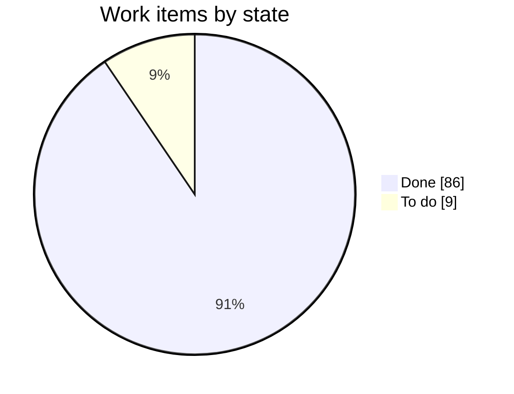
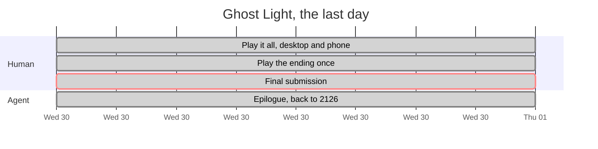

# Status board

**Deadline: Wed 30 September 2026, 23:59 CEST. Last updated Wed 30 Sep, 23:30: submitted, and the evening's changes live.**

`ROADMAP.md` is the plan and says who owns what. This file is the snapshot:
what is finished, what is in flight, and what is still ahead. When something
moves, move its row. The legend is ✅ done · 🔄 in progress · ⬜ to do ·
⏸️ parked · ❓ not recorded either way.

---

## At a glance

| Area | State | Where it stands |
|---|---|---|
| Engine, physics, venue | ✅ | Built, measured, on `main` |
| Chapter I: The Silence | ✅ | Finishable, and the cat horde is done and on `main` |
| Chapter II: JavaPolis | ✅ | Eight breakdowns over a 330 s day (#37); a breakdown now takes the NEXT from any conversation (#53). Balance stands until the author's own cold play says otherwise |
| Chapter III: At Capacity | ✅ | Nine things in Rooms 3–10, merged (#9, #32); the count reads "0 of 9 jobs done" and side quests sit under their own heading (#56) |
| Story between chapters | ✅ | Both wormholes merged (#7, #8), black-zone fix merged (#12); Chapter I opens outside with Voxxy talking (#35) |
| Epilogue: back to 2126 | ✅ | Merged (#77, #78) and played by the author. After Chapter III's card, all three robots go back to the 2126 forecourt, the lights Chapter I restored come back on, and the closing words name the other temples |
| Objective markers | ✅ | Numbered badges shared with the card, one filled NEXT (#49), kept off the HUD and the edge (#55) |
| HUD and dialogue | ✅ | `[E] Continue` in the box (#47), a solid control strip (#48), a card that starts with one job (#51), a banner when a job is done (#54), a keycap talk prompt (#57); HOLD STILL / STAY over the robot while a job that takes time fills (#82) |
| Graphics polish | ✅ | Gait and ring (#16), shadows (#14), mood (#13), HUD (#11); the menu cleaned up (#63) |
| Robot models | ✅ | Rebuilt against the sheets, merged (#17, #18); the author calls them good |
| Attendees | ✅ | Models merged (#17, #18), bunching fixed (#21); long hair and skirts on a third of the crowd (#61) |
| People in the building | ✅ | The speakers, Stephan, Dimitris, Josh and Venkat, and ten more to meet in II and III with no job attached (#60); their lines and bios from sourced research, Chet Haase in Gavin King's place, and looks set from the portraits (#68, #69); the people you meet now talk like people, not like a bio (#70–#72) |
| Collections | ✅ | One book called **Collectables** (#73, #75): prints (#40, #42, #45) as the author's PNGs (#74), the selfie with Dimitris the author's picture too (#83), the who's who with portraits, bios and one colour per era (#59, #68, #76), and the author's eight stickers from Chapter III's stands (#74) |
| Shot-list photographs | ✅ | **All four** in the game: Room 8, BeJUG, Josh and Biggy, the group with Venkat |
| Portraits | ✅ | **All twenty** in (#68): the eighteen real people, the cat and the dog, 512 × 512 PNG, 3.4 MB in all. All eighteen agreed (30 Sep). And the three robots, cropped from their model sheets on the author's call (#83) |
| Venue accuracy | ✅ | **Good enough for now** (the author, 28 Sep); the BOF rooms set out as labs (#46); `#JAVAPOLIS` on the stages in 2006 and screens that glow when a session is on (#75) |
| Audio | ✅ | Music per chapter, robot and interaction sounds; signed off by the author 28 Sep and merged (#22) |
| Phone | ✅ | Stick and buttons (#36); text sized from the real scale and a "Drag here to move" cue (#64); controller-style buttons (#65). Played on a real phone by the author, 30 Sep: everything works. Since then: one INTERACT in place of TALK and DROP (#82), and installable, offline, with an update notice (#80), both headless only so far |
| Pause and endings | ✅ | Pause menu (#38), the clock waits while you read (#39), an end card that says what you chose (#41); Chapter III's card now leads with **Continue** into the epilogue (#77) |
| Playtest | ✅ | Three rounds of notes from test players, all answered and merged (#47–#57, #64, #66); the author's own final playtest, 30 Sep, on desktop and a real phone: everything works |
| Submission | ✅ | **Submitted** on 30 Sep, before the 23:59 CEST deadline. The live build has moved on since (#79–#83), all before the deadline |
| Installable, offline | ✅ | A PWA (#80): Voxxy as the icon, the whole game stored on the first visit, a notice when a new version is ready. `npm run offline` guards it |

```mermaid
pie showData
    title Work items by state
    "Done" : 86
    "To do" : 9
```

---

## ✅ Done: merged to `main`

| What | PR / branch | Notes |
|---|---|---|
| Stack: three.js, TypeScript strict, Vite 6, Pages deploy | — | Live at <https://lomagnette.github.io/ghost-light/> |
| Physics: 120 Hz fixed step, real mass, payload adds mass | — | `npm run physics` keeps the three robots distinct |
| Venue: the Kinepolis in metres, both floors, raked rooms | — | `npm run venue`, `npm run traverse` |
| Three chapters as data, one gameplay screen | — | |
| Verification harnesses | — | `shoot`, `peek`, `physics`, `venue`, `traverse`, `objectives`, `crowd` |
| Library change | #1 `lib-change` | |
| Interior design | #2 `interior-design` | |
| Game intro and NPCs | #3 `introducing-game-and-npc` | |
| Venue graphics | #4 `venue/improve-graphics` | |
| Environment per chapter | #5 `environement-per-chapter-improvement` | |
| Photographer, shot list, Voxxy selfie | #6 `photographer-selfie` | One fixed robot per frame; selfie rendered live |
| Wormhole I → II, Voxxy splits into Droid | #7 `wormhole` | `?exit` to watch it |
| Wormhole II → III, Biggy comes out of Droid | #8 `wormhole-2` | |
| Chapter III lighter: nine required, side quests counted as "extra" | #9 `chapter-3-lighter` | |
| Chapter II as breakdowns: reach, fit, speed, strength | #10 `chapter-2-breakdowns` | Lectern moved for a 0.80 m slot |
| Menu backdrop and readable HUD | #11 `menu-hud` | G on the menu switches graphics |
| Wormhole black zone on real GPUs | #12 `fix-wormhole-black` | NaN scrub before the bloom |
| A mood per era | #13 `mood` | High quality only |
| Soft shadows from a second light | #14 `shadows` | High quality only |
| Objective beacons: ring, beam, robot-shaped icon | #15 `objective-markers` | |
| Robots walk, lean, look round; ring on the driven one | #16 `robots-alive` | |
| Off-screen arrows and focus on the driven robot | `markers-2` | Went to `main` without a PR number |
| Chapter I finishable: three boards, the dark, the cat and dog | — | |
| MIT `LICENSE` and a README | — | README should be reread before submitting |
| **The robots' feel, judged by a person** | — | 27 Sep: the author drove them and calls the feel OK. Closed; the movement numbers stay guarded by `npm run physics` |
| **Both wormholes watched** | — | 27 Sep: the author says they look great. Pacing unchanged: about 4 s to leave, 4 s to arrive |
| Robots rebuilt against the model sheets | #17, #18 `robot-models`, `attendees` | 28 Sep: the author calls them good |
| Attendees with legs, hands, hair, lanyards and a walk | #17, #18 `attendees` | 28 Sep: judged good; the bunching is its own row under To do |
| All four shot-list photographs in the game | `more-cats`, on `main` | 28 Sep: `josh-long.jpeg` and `group.jpeg` added and wired; every print shows at the same 3:2 frame |
| Faster stairs, portraits beside dialogue | #20 `dialogue-portraits` | Stairs at 60% of top speed; portraits go in `src/portraits/` |
| No stutter when a Chapter I light comes on | #19 `fix-light-stutter` | Light rigs prebuilt, no shader recompile |
| **Audio: music and sound** | #22 `audio` | 28 Sep: three Suno tracks, one per chapter, at half level in II and III; robots' steps, impacts and motors and the interaction cues synthesised; Voxxy softened after the first listen. Closed on the author's word. Left for later if ever: brakes, stairs, breakdown cues, cats. Suno's terms for an MIT repo checked by the author, 30 Sep |
| Title sequence and lore, before the menu | #24 `intro` | 28 Sep: seven lines over the dark hall with Chapter I's music, about 50 s, the author's 2126 frame; starts on its own, the first key turns the sound on, then any key (or ESC at any time) skips; plays once, I replays. Hints, never explains: SPEC's rule that the game does not say why the building is empty still holds. Merged (#24) |
| Room 6 has a way in | #23 `room-6-door` | 28 Sep: its door opened onto the open well beside the grand stair; moved to the north end. `npm run traverse` now walks into all fourteen rooms |
| **Chapter I cats**: five at the start and one every 20 s up to 16, eight coats, a horde that follows Voxxy round walls and up the stairs and slows it, the dog sends them away | `more-cats`, on `main` | 28 Sep: done, on the author's word |
| Attendees no longer bunch into every room's north-east corner | #21 `crowd-spread` | `npm run crowd` guards it: worst cell 3.6× the average |
| **The venue remodelled zone by zone, from the author's plans** | #25 `reception-east`, #26 `stair-cores`, #27 `hall-threshold`, #28 `reception-centre`, #29 `hall-north-east` | 28 Sep, the author: "good enough for now". What changed:<ul><li>the hall flights are walled cores entered from the side;</li><li>the hall is a bay deeper, and the threshold has a landing with steps on three sides and no ramp;</li><li>two BOF rooms down three steps, and toilets in the north-east corner;</li><li>the reception island, five pillars and the free counter are on the column grid;</li><li>the grand flight runs wall to wall, with the corridor upstairs 5.4 m wider along its whole east side;</li><li>the hall's east side steps as drawn, and the polo pickup is an L-shaped counter</li></ul> |
| Glass doors across the whole front; the storey swaps half way up a flight; one tread per riser; a 10.2 m grand flight of 34 steps | #30 `entrance-doors`, #31 `stair-treads` (with `stair-swap`) | 28 Sep |
| **The objects the jobs are about, and Chapter II retuned** | #32 `job-props` | 28 Sep: every job shows its object (board, rack, projector, cable, adapter, chairs, coffee, keg, shutter, mic, scanner, polo) with a lamp for broken or fixed; the zones and pickup range are wider, and the projector counts anywhere in the back aisle. Devoxx uses Rooms 3–10, JavaPolis 3–8. Chapter II has nine breakdowns, not eleven, with longer windows and gaps for the speakers |
| **Stanchions where the rooms in use stop** | #33 `session-drape` | 28 Sep: posts and a red rope across the upstairs corridor, open in the middle. The author: "perfect" |
| **Long tables along the corridor**, between Rooms 5/6 and 7/8 | #34 `corridor-tables` | 28 Sep: chairs on both sides, a metre off the wall, starting 2 m past each door so the entrances stay free; the chair flicker (coplanar faces) is fixed. The west tables show only through the cutaway |
| **Chapter II and III balance** | #32 `job-props` | 28 Sep: done for now, on the author's word. Chapter II has nine breakdowns with longer windows; Rooms 3–8 for JavaPolis, 3–10 for Devoxx. Reopen after the stranger playtest if it shows a wall |
| **Performance checked on real hardware** | — | 27 Sep: the author reports the frame rate fine. The one stutter, a Chapter I light coming on, is fixed on `fix-light-stutter` (no shader recompile). Closed; reopen if anything shows up |
| **Chapter I opens outside, with Voxxy talking** | #35 `chapter-one-landing` | The forecourt, four lines from Voxxy before the player drives |
| **Plays on a phone** | #36 `touch-controls` | Stick, TALK / BRAKE / ROBOT / DROP, tap a box to page it, bigger text, rotate message, low graphics by default. Played on a real phone, 30 Sep |
| **Chapter II loosened again** | #37 `chapter-2-slack` | Eight breakdowns, windows about 40% longer, a 330 s day; the phone stick reaches full speed at 80% of its travel |
| **Pause menu** | #38 `pause-menu` | ESC or PAUSE: Resume, Who's who, Restart, Leave run; R asks first; turning a phone upright or leaving the tab pauses |
| **The clock waits while you read** | #39 `hold-for-story`, #43 `reading-hint` | A conversation or a print, with the robot not driving, holds the sim, crowd, cats and clock; "Time paused while reading" under the clock |
| **Photo album** | #40 `photo-album`, #42 `album-phone`, #45 `album-keys` | Every print kept in the browser; P on the menu and the end card; readable on a phone; keyboard-driven |
| **An ending that says what you chose** | #41 `ending-card` | What you did, what you let go, the run's prints, one tip; Retry / Album / Who's who / Chapter select |
| **The BOF rooms set out as labs** | #46 `bof-labs` | Seven rows each, tables either side of a 1.4 m passage, facing a presenter's table and screen |
| **A tester's first five points** | #47 `dialogue-continue`, #48 `hint-contrast`, #49 `marker-numbers`, #51 `first-job`, #50 `menu-start-here` | `[E] Continue` in the box and SPACE/ENTER page it; a solid control strip; numbered markers matching the card with one filled NEXT; the card starts with one job and opens out after the first action or 45 s; START HERE on Chapter I and a recap on II and III |
| **A tester's second five points** | #53 `next-on-clock`, #54 `done-banner`, #55 `marker-safe-area`, #56 `score-label`, #57 `talk-range` | A breakdown takes the NEXT; "✓ Concourse power restored"; badges clear of the HUD, the edge and each other; "0 of 9 jobs done" with side quests apart; "[E] Talk to Stephan", dimmed just out of range |
| **Who's who** | #59 `whos-who` | A card for every person met, numbered, a silhouette until then; NEW CARD when it happens; C on the menu and end card, and in the pause menu |
| **People to meet in II and III** | #60 `corridor-people` | Bruno Souza, Guillaume Laforge, Antonio Goncalves; Tom Cools, Brian Vermeer, Alexander Chatzizacharias, Alina Yurenko, Ana-Maria Mihalceanu, Holly Cummins, Kevin Dubois. No marker, outside every count; one narrated line each, since nobody has agreed words for them |
| **A mixed crowd** | #61 `crowd-mix` | A third of the crowd with long hair, a little under half of those in a skirt or dress; Alina blond, Ana-Maria dark brown, Holly black, as the author gave them |
| Status updates | #52 `status-playtest`, #58 `status-playtest-2` | |
| **The photographs needed, listed** | #64 (with `portrait-list`) | `src/portraits/README.md`: the eighteen real people, the exact file names, an Agreed box each; their actual photograph, 512 × 512. Collecting them is the to-do below |
| **Phone text and the movement cue** | #64 `mobile-text` | Text sized from the stage's real scale (10.5 real px for a 12 px line); pause and end card fit; bigger menu cards; a "Drag here to move" ghost stick until the first drag. Checked headless at 844 × 390, then on a real phone, 30 Sep |
| **Touch buttons as a controller's diamond** | #65 `pad-diamond` | TALK bottom, BRAKE right, DROP left, ROBOT top; the card steps left of them when it would reach them |
| **The end card names what ended the run** | #66 `failure-advice` | "Out of time", what ran out, and a tip for it (the dog: north into the hall, follow its marker) |
| **Research on every real person** | #68 `npc-research` | Sourced bios on every card; Chapter II lines true as of Dec 2006; the ten to meet narrated with who they are. Sources in `docs/PROMPTS.md` |
| **Chet Haase in Gavin King's place** | #68 `npc-research` | Swing, Java 2D, Java SE 6, Filthy Rich Clients; no JavaPolis talk found for either |
| **All twenty portraits** | #68 `npc-research` | 512 × 512 PNG via `tools/portraits.py`; originals in the git-ignored `portrait-sources/`; looks set from them |
| Status updates | #63, #67 `docs-refresh`, `status-after-66` | |
| **The named people look like their portraits** | #69 `npc-looks` | |
| **The people you meet talk** | #70 `richer-talk`, #71 `real-chat`, #72 `friendlier` | More to say, from the research; they talk like people rather than like a bio; each card records the year you met them, and each chapter opens on its year |
| **One book for everything collected** | #73 `souvenir-album`, #74 `sticker-files`, #75 `cinema-rooms` | Prints, the who's who and stickers in one place, called Collectables; the prints are the author's 1500 × 1000 PNGs and the stickers the author's eight, each with its line |
| **`#JAVAPOLIS` on the 2006 stages, screens that glow** | #75 `cinema-rooms` | A room's screen glows while a session is on in it |
| **One colour per era on the who's who** | #76 `era-colours` | 2126 pink, 2006 gold, 2026 Devoxx orange; cards not yet met are faintly tinted |
| **Epilogue: Homecoming** | #77, #78 `homecoming` | Back to the 2126 forecourt, the lights restored, the other temples named by country. Played by the author, 30 Sep |
| Portrait agreements and Suno's terms checked | `rights-checked` | All eighteen agreed; Suno's terms fine for an MIT repo |
| **The author's final playtest, desktop and a real phone** | — | 30 Sep: the whole game including the ending; everything works, phone included. Nothing to tune |
| **Submitted** | — | 30 Sep, before 23:59 CEST |
| Status update | #79 `status-submitted` | |
| **Installable, and plays offline** | #80 `pwa` | Manifest, Voxxy icon, every file stored on the first visit (about 16.7 MB); a new build waits, and a notice offers UPDATE; `npm run offline` cuts the network and checks every file, every chapter and the update |
| **One INTERACT** | #82 `interact` | E talks when someone is in range, and otherwise puts down what the robot carries; SPACE no longer drops; the phone's DROP button is gone. Putting something down had never worked: the robot took it straight back. Fixed |
| **HOLD STILL over the robot** | #82 `wait-indicator` | While a job that takes time fills: HOLD STILL, STOP HERE, STAY, or WAITING FOR EVERYONE, with a bar and the seconds left |
| **The selfie with Dimitris is the author's picture** | #83 `dimitris-print` | Was a capture of the game's own canvas; an old capture no longer stands in for it |
| **The robots' portraits** | #83 `robot-portraits`, `polish` | Crops of the model sheets, on a dark ground |
| Polish | `polish` | Haul notices name the thing ("Put the keg down"); a spill costs a trip back, as a put-down does |

---

## 🔄 In progress

`polish`: this update, the haul notices, spills, and the robots' portraits on a dark ground. Everything through #83 is on `main`.

> **Pushing from the sandbox** still fails on credentials, so branches reach
> GitHub from the host. To let the agent push and open PRs itself:
> `sbx secret set github --sandbox devoxx-game -t "$(gh auth token)"`

---

## ⬜ To do

### Left over from the last day

| What | Owner | Notes |
|---|---|---|
| **Try the evening's changes on a real phone** | Human | Install it to the home screen and open it in airplane mode; INTERACT; the HOLD STILL chip. All checked headless only |
| Name the tool behind the Dimitris picture | Human | `docs/PROMPTS.md` says "not recorded yet" |
| Read the real people's lines and cards ❓ | Human | Not recorded either way. Bios and lines are from sourced research (`docs/PROMPTS.md`); a few Chapter II lines are interpretation rather than quotes, e.g. Goetz on concurrency and Stephan on why people come |

### Design follow-ups, added 27 Sep

| What | Owner | Notes |
|---|---|---|
| **Better story content for Chapter II** | Human · agent | The corridor conversations and the breakdowns carry the chapter now, but not a story of their own. What is JavaPolis 2006 about, for the two robots who just fell into it? Worth deciding before the dialogue pass below, which would rewrite the same lines |
| **Tune the dialogue against real transcripts** | Human supplies transcripts · agent rewrites | Make each speaker sound like themselves: cadence, phrasing, what they tend to talk about. The rules stay: nothing put in anyone's mouth that is not plainly true of their public work, and Chapter II stays era-locked around 2006. The sandbox cannot browse, so transcripts or links come from the host; each source is logged in `docs/PROMPTS.md` |

| **Words for the ten people to meet** | Human | Each is narrated, saying who they are from their public work; their looks are set from the portraits. Agreed first-person lines, if any, are one entry each in `src/chapters/objectives.ts` |
| **Chet Haase and JavaPolis** | Human | He replaces Gavin King (29 Sep); his lines are sourced to late 2006, his look is from the portrait. No JavaPolis talk of his was found (nor of Gavin King's). Guillaume Laforge's JavaPolis evidence is 2007 only |

### Small, whenever there is a gap

| What | Owner | Notes |
|---|---|---|
| Watch the four drone flights against the blockout | Human | Not blocking |
| **One improvement to the cinema rooms**, for later | Human names it · agent builds | 28 Sep: the author has one in mind and hasn't said what it is yet. The rest of the venue is good enough for now |

### Open decisions

| Decision | Default if unanswered |
|---|---|
| Arrows in Chapter I: always, off, or only after 30 s without progress? | Always (current). Chapter I is about finding your way in the dark, and they point at every board — and now at every ticking cat |
| Skin in the crowd: the stylised warm band, or a real range for the anonymous crowd only? | Stylised band (current). A real range on the named people is out either way |

### If behind, cut in this order (from `ROADMAP.md`)

1. Chapter II shrinks to a 60-second set piece
2. Chapter II goes entirely
3. Audio drops to footfall only
4. Art stays partial
5. One floor instead of two

**Never cut:** the live build, `LICENSE`, the README, three robots doing distinct things, `docs/PROMPTS.md`.

---

## ⏸️ Parked: after the deadline

| What | Why parked | Notes |
|---|---|---|
| Voiced dialogue | Real people's voices; consent first | Default if it happens is a non-verbal blip per character. See `ROADMAP.md` |

---

## Timeline, the last day

```mermaid
gantt
    title Ghost Light, the last day
    dateFormat YYYY-MM-DD
    axisFormat %a %d
    section Human
    Play it all, desktop and phone    :done, h1, 2026-09-30, 1d
    Play the ending once              :done, h4, 2026-09-30, 1d
    Final submission                  :done, crit, s2, 2026-09-30, 1d
    section Agent
    Epilogue, back to 2126            :done, g2, 2026-09-30, 1d
```
